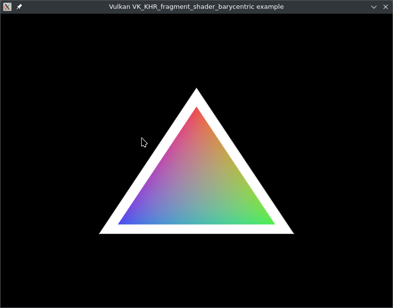

# Description

A minimal Vulkan VK_KHR_fragment_shader_barycentric triangle example, which demonstrates the use of the barycentric coordinates in the fragment shader. 

# Prerequisites

- Vulkan SDK
- SDL2
- CMake
- C compiler

# Build (Linux)

```bash
$ cmake .
$ make
```

# Run (Linux)

```bash
$ ./vulkanbarycentrictest
```

# Build (Windows)

```bash
$ cmake -G "Visual Studio 17 2022 Win64" .
```

Open the generated Visual Studio solution and build it.

# Run (Windows)

Open a command prompt and run the executable.

# Screenshot



# License

zlib see LICENSE file

